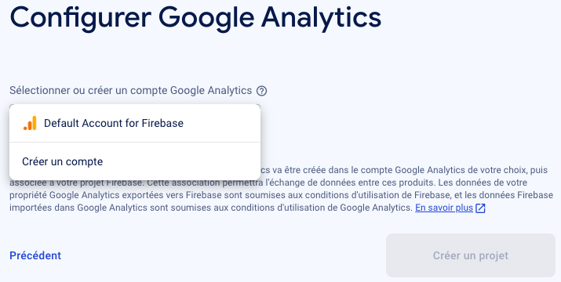

#### --------------------------------
####
####  ANGULAR - FIREBASE
####
#### ---------------------------------

#### 1 - CREATE NEW PROJECT ON FIREBASE-GOOGLE
in google search , search firebase or go to your firebase account.
create new  project:
step 1

step 2

step 3

step 4: choisissez default, puis cliquez: continuer

step 5: Si tout se passe bien , votre espace projet sera créer:

#### 2 - CREATE NEW APPLICATION INSIDE YOUR POJECT
inside your project dashboard, click </> (voir image ci-dessus) and create new project
you'will be provided a key like :
renseignez le nom que vous souhaiter donner à votre application puis valider. 

export const environment = {
  production: false,
  firebase: {
    apiKey: 'YOUR_API_KEY',
    authDomain: 'YOUR_AUTH_DOMAIN',
    databaseURL: 'YOUR_DATABASE_URL',
    projectId: 'YOUR_PROJECT_ID',
    storageBucket: 'YOUR_STORAGE_BUCKET',
    messagingSenderId: 'YOUR_MESSAGING_SENDER_ID'
  }
};

### 3 ENABLE AUTHENTIFICATION INSIDE YOUR PROJECT DASHBOARD 
Cliquez sur acceder à la console.et vous atterisserez ici: 

choisissez authentification, vous atterisserez ici 

cliquez sur commencer, vous aterrisserez ici

choisissez google

puis activer  le bouton (en haut à droite) et rensigner votre email, puis valider

### 4 - NOW LOG IN FIREBASE FROM YOUR COMMAND LINE, Write the following command and hit enter
```
firebase login
```

### 5 - INTEGRATE FIREBASE TO YOUR ANGULAR APPLICAION
```
ng add @angular/fire
```
If you're asked: choose ng deploy -- hosting, Authentication, Firestore, Realtime Database (choose them by simply moving and clicking space keyword as it is suggested) and for  second question choose your_project_name, europe-west1 (Belgium), https://multichatroom.web.app.

Now you get Angularfire installed and normally added to your src/app/app.module.ts


### 6 - CREATE YOUR ANGULAR PROJECT ON COMMANDE LINE

a -  ng new  auth-service-tutorial

>-  Which stylesheet format would you like to use?  choose: SCSS

>- Do you want to enable Server-Side Rendering (SSR) and Static Site Generation: 
     choose: yes 


### 7 - LAUNCH THE SERVER
 >- http://localhost:4200


#### ANNEXE: Angular , Node, ypescript Compatible version


